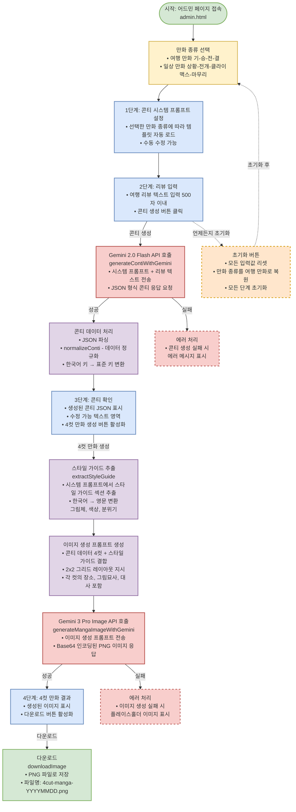

# 4cut Review Manga - 프로세스 흐름도

## 전체 프로세스 플로우

## 주요 단계 설명

### 1. 초기 설정
- **만화 종류 선택**: 여행 만화 또는 일상 만화 선택
- **시스템 프롬프트 설정**: 선택한 만화 종류에 따라 템플릿 자동 로드

### 2. 콘티 생성 프로세스
- **리뷰 입력**: 사용자가 여행 리뷰 텍스트 입력 (500자 이내)
- **API 호출**: Gemini 2.0 Flash로 콘티 생성
- **데이터 처리**: JSON 파싱 및 정규화 (한국어 키 → 표준 키 변환)
- **콘티 확인**: 생성된 콘티 JSON 표시 및 수정 가능

### 3. 이미지 생성 프로세스
- **스타일 가이드 추출**: 시스템 프롬프트에서 스타일 정보 추출 및 영문 변환
- **프롬프트 생성**: 콘티 데이터와 스타일 가이드 결합
- **API 호출**: Gemini 3 Pro Image로 4컷 만화 이미지 생성
- **결과 표시**: 생성된 이미지 미리보기 및 다운로드

### 4. 에러 처리
- **콘티 생성 실패**: 에러 메시지 표시
- **이미지 생성 실패**: 플레이스홀더 이미지 표시

### 5. 초기화 기능
- 언제든지 모든 단계를 초기화하여 처음부터 다시 시작 가능

## 색상 범례

- 🟢 **초록색**: 시작/종료 단계
- 🟡 **노란색**: 사용자 입력/선택
- 🔵 **파란색**: 단계별 프로세스
- 🔴 **빨간색**: API 호출
- 🟣 **보라색**: 데이터 처리
- 🟠 **주황색**: 옵션/에러 처리 (점선)

## API 함수

- `generateContiWithGemini()`: 콘티 생성
- `normalizeConti()`: 콘티 데이터 정규화
- `extractStyleGuide()`: 스타일 가이드 추출
- `generateMangaImageWithGemini()`: 이미지 생성
- `downloadImage()`: 이미지 다운로드
